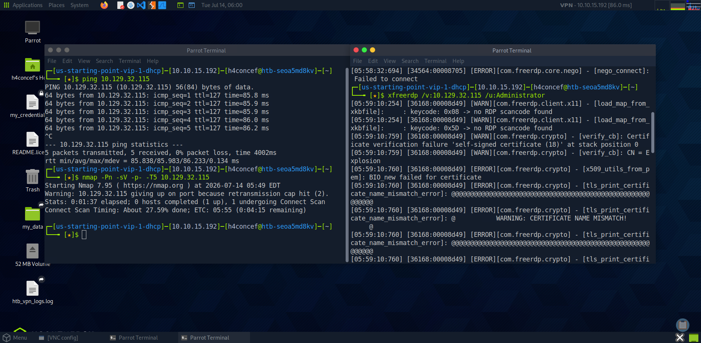
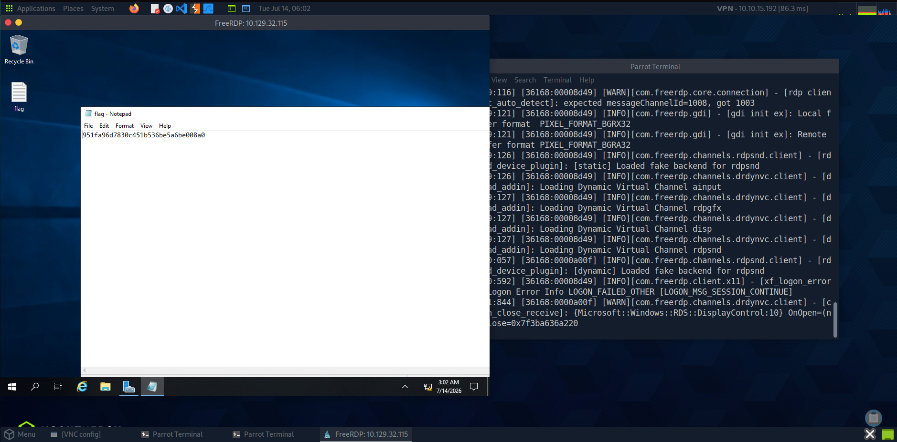

      /\_____/\
    (  ^   ^  )   ██╗  ██╗ █████╗  ██████╗██╗  ██╗████████╗██╗  ██╗███████╗██████╗  ██████╗ ██╗  ██╗
    ( (  ω  ) )   ██║  ██║██╔══██╗██╔════╝██║ ██╔╝╚══██╔══╝██║  ██║██╔════╝██╔══██╗██╔═══██╗╚██╗██╔╝
     \ ~~~~~ /    ███████║███████║██║     █████╔╝    ██║   ███████║█████╗  ██████╔╝██║   ██║ ╚███╔╝
      )     (     ██╔══██║██╔══██║██║     ██╔═██╗    ██║   ██╔══██║██╔══╝  ██╔══██╗██║   ██║ ██╔██╗
     (  ~~~  )    ██║  ██║██║  ██║╚██████╗██║  ██╗   ██║   ██║  ██║███████╗██████╔╝╚██████╔╝██╔╝ ██╗
      `~~~~~´     ╚═╝  ╚═╝╚═╝  ╚═╝ ╚═════╝╚═╝  ╚═╝   ╚═╝   ╚═╝  ╚═╝╚══════╝╚═════╝  ╚═════╝ ╚═╝  ╚═╝
╔══════════════════════════════════════════════════════════════════════════╗
║                                                                        ║
║ ███████╗██╗  ██╗██████╗ ██╗      ██████╗ ███████╗██╗ ██████╗ ██╗   ██╗   ║
║ ██╔════╝╚██╗██╔╝██╔══██╗██║     ██╔═══██╗██╔════╝██║██╔═══██╗████╗ ██║   ║
║ █████╗   ╚███╔╝ ██████╔╝██║     ██║   ██║███████╗██║██║   ██║██╔██╗██║   ║
║ ██╔══╝   ██╔██╗ ██╔═══╝ ██║     ██║   ██║╚════██║██║██║   ██║██║╚██╗██║  ║
║ ███████╗██╔╝ ██╗██║     ███████╗╚██████╔╝███████║██║╚██████╔╝██║ ╚████║  ║
║ ╚══════╝╚═╝  ╚═╝╚═╝     ╚══════╝ ╚═════╝ ╚══════╝╚═╝ ╚═════╝ ╚═╝  ╚═══╝  ║
║                                                                        ║
║              [ HackTheBox — Starting Point ]                           ║
║                                                                        ║
╚══════════════════════════════════════════════════════════════════════════╝
🔑 Machine Info
┌──────────────────────────────────────────────────┐
│  Name       : Explosion                          │
│  OS         : Windows                            │
│  Difficulty : Very Easy                          │
│  Rating     : ⭐ 4.7/5 (133)                     │
│  XP Reward  : 150 XP                             │
│  Theme      : RDP / Misconfiguration             │
│  Player #   : 312646                             │
└──────────────────────────────────────────────────┘
🎯 Objective
Exploiter un serveur RDP (Remote Desktop Protocol) mal configuré avec un compte Administrateur disposant d'un mot de passe vide (blank password) pour accéder au bureau distant et récupérer le flag.
📝 Tasks & Answers
┌────┬────────────────────────────────────────────────────────────────────────────────┬─────────────────────────┐
│ #  │ Question                                                                       │ Answer                  │
├────┼────────────────────────────────────────────────────────────────────────────────┼─────────────────────────┤
│ 01 │ What does the 3-letter acronym RDP stand for?                                  │ Remote Desktop Protocol │
│ 02 │ 3-letter acronym referring to interaction with host via command line interface?│ CLI                     │
│ 03 │ What about graphical user interface interactions?                                │ GUI                     │
│ 04 │ Name of an old remote access tool (unencrypted, port 23)?                      │ Telnet                  │
│ 05 │ What is the name of the service running on port 3389 TCP?                      │ ms-wbt-server           │
│ 06 │ Switch used to specify target host's IP address when using xfreerdp?           │ /v:                     │
│ 07 │ Username that successfully returns a desktop projection with a blank password? │ Administrator           │
└────┴────────────────────────────────────────────────────────────────────────────────┴─────────────────────────┘
🔍 Walkthrough
Step 1 — Ping & Nmap Scan
ping 10.129.32.115
nmap -p- -sV 10.129.32.115
Vérification de la connectivité et scan des ports pour identifier le service RDP sur le port 3389.

Step 2 — Connect with xfreerdp
xfreerdp /v:10.129.32.115 /u:Administrator
Connexion au bureau distant en utilisant le compte Administrator sans mot de passe.
Acceptation du certificat et bypass du prompt Domain/Password en appuyant sur Entrée.

Step 3 — Get the Flag 🚩
Une fois sur le bureau distant, le flag est affiché dans Notepad.
Récupérer la valeur du root flag: 951fa96d7830c451b536be5a6be008a0.

🏁 Result
╔═══════════════════════════════════════════╗
║                                           ║
║   🚩  ROOT FLAG OWNED  🚩                 ║
║                                           ║
║   Congratulations H4concef!               ║
║   You are player #312646                  ║
║   to have solved Explosion.               ║
║                                           ║
╚═══════════════════════════════════════════╝
📚 Concepts Learned
┌─────────────────────────┬──────────────────────────────────────────────────────┐
│ Concept                 │ Description                                          │
├─────────────────────────┼──────────────────────────────────────────────────────┤
│ RDP                     │ Protocole Microsoft permettant d'accéder à un bureau │
│                         │ distant via une interface graphique (GUI).           │
│ xfreerdp                │ Client en ligne de commande (CLI) pour se connecter  │
│                         │ aux serveurs RDP sous Linux.                         │
│ Blank Passwords         │ Faille critique de configuration autorisant          │
│                         │ l'accès sans fournir de mot de passe.                │
│ Nmap & Ping             │ Outils pour vérifier l'état de l'hôte et énumérer    │
│                         │ les services réseau (port 3389 ouvert).              │
└─────────────────────────┴──────────────────────────────────────────────────────┘
🛠️ Tools Used
• ping       — Test de connectivité réseau (ICMP)
• nmap       — Scanner de ports et services
• xfreerdp   — Client Remote Desktop Protocol (RDP)
📂 Repository Structure
EXPLOSION/
├── README.md
└── IMG/
    ├── ping.png
    ├── nmap_scan.png
    ├── xfreerdp.png
    └── flag.png
👤 Author
   ╔═══════════════════════════════╗
   ║  H4concef — Player #312646    ║
   ║  HackTheBox Starting Point    ║
   ╚═══════════════════════════════╝
Writeup réalisé dans le cadre du parcours Starting Point de HackTheBox.
