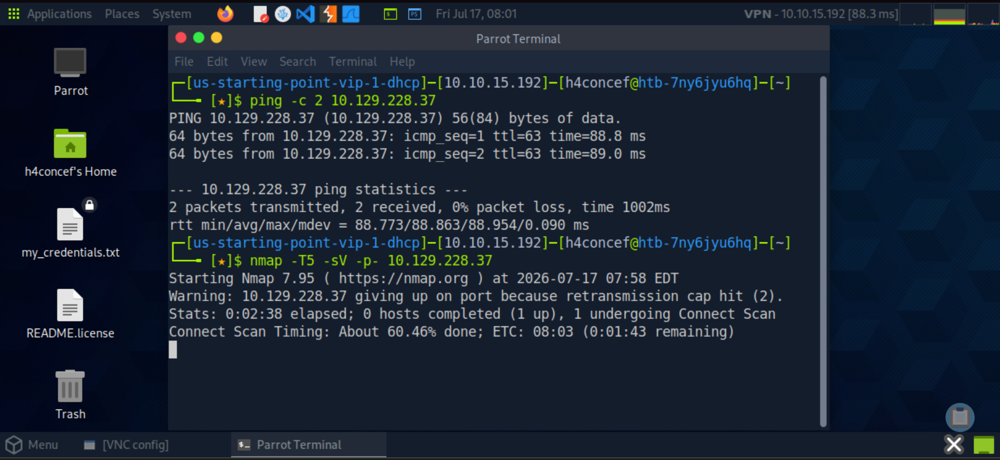
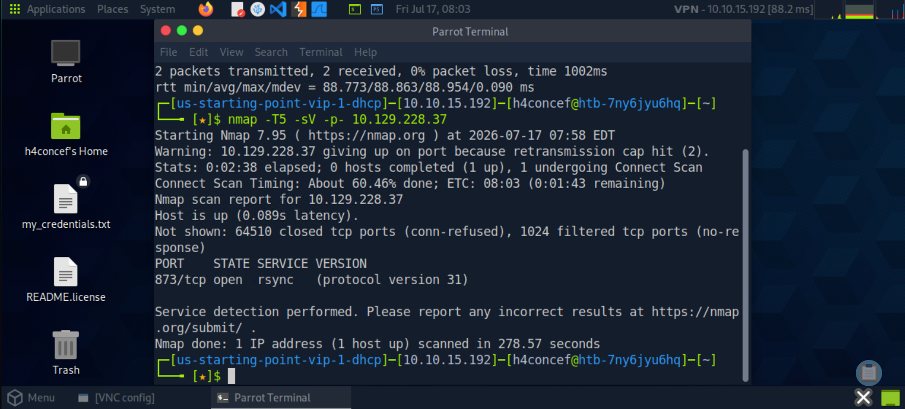
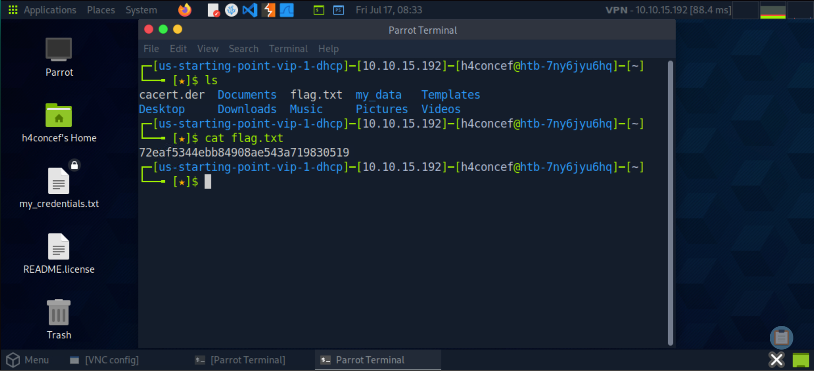

# 🔥 HackTheBox - Synced

```text
      /\_____/\
    (  ^   ^  )   ██╗  ██╗ █████╗  ██████╗██╗  ██╗████████╗██╗  ██╗███████╗██████╗  ██████╗ ██╗  ██╗
    ( (  ω  ) )   ██║  ██║██╔══██╗██╔════╝██║ ██╔╝╚══██╔══╝██║  ██║██╔════╝██╔══██╗██╔═══██╗╚██╗██╔╝
     \ ~~~~~ /    ███████║███████║██║     █████╔╝    ██║   ███████║█████╗  ██████╔╝██║   ██║ ╚███╔╝
      )     (     ██╔══██║██╔══██║██║     ██╔═██╗    ██║   ██╔══██║██╔══╝  ██╔══██╗██║   ██║ ██╔██╗
     (  ~~~  )    ██║  ██║██║  ██║╚██████╗██║  ██╗   ██║   ██║  ██║███████╗██████╔╝╚██████╔╝██╔╝ ██╗
      `~~~~~´     ╚═╝  ╚═╝╚═╝  ╚═╝ ╚═════╝╚═╝  ╚═╝   ╚═╝   ╚═╝  ╚═╝╚══════╝╚═════╝  ╚═════╝ ╚═╝  ╚═╝

╔══════════════════════════════════════════════════════════════════════════════════╗
║                                                                                ║
║  ███████╗██╗   ██╗███╗   ██╗ ██████╗███████╗██████╗                           ║
║  ██╔════╝╚██╗ ██╔╝████╗  ██║██╔════╝██╔════╝██╔══██╗                          ║
║  ███████╗ ╚████╔╝ ██╔██╗ ██║██║     █████╗  ██║  ██║                          ║
║  ╚════██║  ╚██╔╝  ██║╚██╗██║██║     ██╔══╝  ██║  ██║                          ║
║  ███████║   ██║   ██║ ╚████║╚██████╗███████╗██████╔╝                          ║
║  ╚══════╝   ╚═╝   ╚═╝  ╚═══╝ ╚═════╝╚══════╝╚═════╝                          ║
║                                                                                ║
║                  [ HackTheBox — Starting Point ]                               ║
║                                                                                ║
╚══════════════════════════════════════════════════════════════════════════════════╝
```

## 🔑 Machine Info

```text
┌──────────────────────────────────────────────────┐
│  Name       : Synced                             │
│  OS         : Linux                              │
│  Difficulty : Very Easy                          │
│  Rating     : ⭐ 4.7/5 (116)                     │
│  XP Reward  : 150 XP                             │
│  Theme      : Rsync / File Share Enumeration     │
│  Player #   : 55994                              │
└──────────────────────────────────────────────────┘
```

---

## 🎯 Objective

Le but de ce laboratoire est de démontrer comment un service **rsync** mal configuré et exposé sans authentification peut être exploité. L'objectif consiste à scanner les ports ouverts, identifier le service rsync sur le port `873`, lister les partages disponibles, accéder au partage public et récupérer le flag directement depuis le système de fichiers distant.

---

## 📝 Tasks & Answers

```text
┌────┬──────────────────────────────────────────────────────────────────────────────────────────────────────┬────────────┐
│ #  │ Question                                                                                             │ Answer     │
├────┼──────────────────────────────────────────────────────────────────────────────────────────────────────┼────────────┤
│ 01 │ What is the default port for rsync?                                                                  │ 873        │
│ 02 │ How many TCP ports are open on the remote host?                                                      │ 1          │
│ 03 │ What is the protocol version used by rsync on the remote machine?                                    │ 31         │
│ 04 │ What is the most common command name on Linux to interact with rsync?                                │ rsync      │
│ 05 │ What credentials do you have to pass to rsync in order to use anonymous authentication?              │ None       │
│ 06 │ What is the option to only list shares and files on rsync?                                           │ --list-only│
└────┴──────────────────────────────────────────────────────────────────────────────────────────────────────┴────────────┘
```

---

## 🔍 Walkthrough

### Step 1 — Reconnaissance & Connectivity Check (Ping)

> Dans un premier temps, nous vérifions la connectivité réseau avec la cible via une requête ICMP (`ping`) afin de confirmer que l'hôte est actif et accessible sur le réseau.

```bash
ping 10.129.X.X
```



---

### Step 2 — Network Scanning & Service Enumeration (Nmap)

> Un scan réseau via `nmap` avec détection de version (`-sV`) est effectué pour identifier les services exposés. Il révèle **1 seul port TCP ouvert** : le port `873`, sur lequel tourne **rsync** en version de protocole **31** — sans aucune authentification requise.

```bash
nmap -sV 10.129.X.X
```



---

### Step 3 — Listing des Partages Rsync (--list-only)

> Nous utilisons `rsync` avec l'option `--list-only` pour lister tous les partages disponibles sur le serveur cible sans fournir de credentials. Un partage nommé **`public`** est découvert, indiquant qu'il est accessible de manière anonyme.

```bash
rsync --list-only rsync://10.129.X.X/
```


---

### Step 4 — Accès au Partage Public & Listing des Fichiers

> Une fois le partage `public` identifié, nous nous y connectons et listons son contenu avec `--list-only`. Un fichier nommé **`flag.txt`** est directement visible à la racine du partage, sans nécessiter d'authentification.

```bash
rsync --list-only rsync://10.129.X.X/public
```


---

### Step 5 — Téléchargement & Lecture du Flag 🚩

> Nous téléchargeons le fichier `flag.txt` depuis le partage public puis affichons son contenu avec `cat`. Le **Root Flag** est directement retourné, validant ainsi la compromission totale de la machine.

```bash
rsync rsync://10.129.X.X/public/flag.txt .
cat flag.txt
```



---

## 🏁 Result

```text
╔═══════════════════════════════════════════╗
║                                           ║
║   🚩  ROOT FLAG OWNED  🚩                 ║
║                                           ║
║   Congratulations H4concef!               ║
║   You are player #55994                   ║
║   to have solved Synced.                  ║
║                                           ║
╚═══════════════════════════════════════════╝
```

---

## 📚 Concepts Learned

```text
┌──────────────────────────┬──────────────────────────────────────────────────────┐
│ Concept                  │ Description                                          │
├──────────────────────────┼──────────────────────────────────────────────────────┤
│ Rsync                    │ Outil de synchronisation de fichiers à distance      │
│                          │ utilisant le port 873 par défaut.                   │
│ Port 873                 │ Port par défaut de rsync, souvent exposé sans        │
│                          │ authentification dans des configs mal sécurisées.   │
│ --list-only              │ Option rsync pour lister les partages et fichiers    │
│                          │ disponibles sans téléchargement.                    │
│ Anonymous Auth           │ Rsync peut être configuré sans credentials —         │
│                          │ aucun identifiant nécessaire (None).                │
│ Protocol Version 31      │ Version du protocole rsync identifiée par nmap.     │
│ File Exfiltration        │ Récupération directe de fichiers sensibles via       │
│                          │ un partage rsync public non authentifié.            │
│ Nmap -sV                 │ Détection de version des services sur les ports.    │
└──────────────────────────┴──────────────────────────────────────────────────────┘
```

---

## 🛠️ Tools Used

```text
• ping       — Test de connectivité réseau (ICMP)
• nmap       — Scanner de ports et services (-sV)
• rsync      — Outil de synchronisation / accès aux partages distants
• cat        — Lecture du contenu du fichier flag.txt
```

---

## 📂 Repository Structure

```text
SYNCED/
├── README.md
└── IMG/
    ├── ping.png
    ├── nmap.png
    ├── list_only.png
    ├── rsync_public.png
    └── flag.png
```

---

## 👤 Author

```text
   ╔═══════════════════════════════╗
   ║  H4concef — Player #55994     ║
   ║  HackTheBox Starting Point    ║
   ╚═══════════════════════════════╝
```

> Writeup réalisé dans le cadre du parcours **Starting Point** de HackTheBox.
